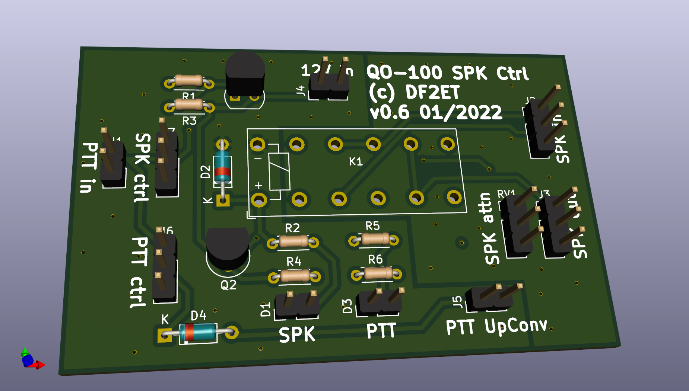

# QO100_SPK_ctrl
Speaker control unit for full-duplex satellite operations for the sake of demonstration

This circuit is designed to control the speaker level of a full-duplex satellite station during transmissions. It was originally designed to be used for a club station in order to demonstrate full-duplex satellite operations with audio output via speaker. In order to attenuate the audio level during transmissions to avoid feedback the audio line is attenuated with a 49-ohm potentiometer. The switching between RX and TX is done via PTT output of the TRX.

## Schematics

The [circuit schematics](QO100_SPK_ctrl.svg) is a simple relay switch using two PNP transistors. For manual control two switches are added so that the speaker attenuation as well as the PTT line of the UpConverter can be switched manually.

## Bill of Materials

The [few parts](QO100_SPK_ctrl.xlsx) can be grabbed from the spare parts box. For other purposes there is a shopping cart at German distributor Reichelt Eletronik. See [here](https://www.reichelt.de/my/1923061). This does not include the relay. Few of those can be obtained from the author. Same goes for the PCB itself. The LEDs as well as the trimmer are layouted as 2.54mm connectors so that the parts itself can be mounted in a case.

The [interactive BOM](bom/ibom.html) for sourcing and placing the parts can be found in the bom folder of this project.

## Known Issues

The v0.5 PCB and circuit were missing diode D4. Due to this the PTT transistor was pulled low by the UpConverter. This error has been corrected in v0.6.
